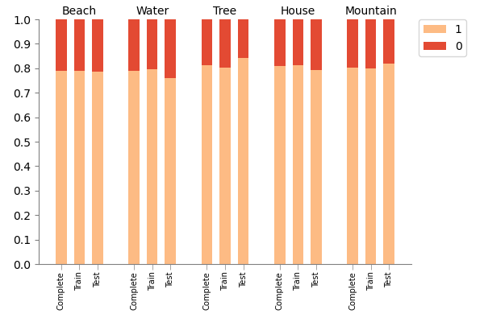
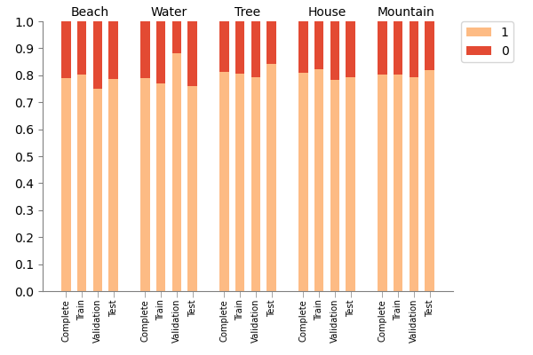

# maestros - Multi-label Stratified Group Splits

`maestros` is a Python library that provides functionality for performing multi-label stratified group splits. This library is particularly useful for machine learning tasks involving multi-label data with grouped samples, where the train and test sets need to be stratified to maintain the label distribution, while ensuring the groups are disjoint. The multi-label stratification is done through the [iterative-stratification](https://github.com/trent-b/iterative-stratification) library. The included stratification chart and report can also be used for multi-label data where samples do not belong to groups.

## Features

- Perform multi-label stratified group splits, ensuring that groups are disjoint.
- Create stratification reports to analyze the distribution of labels across the complete dataset and the train and test sets.
- Visualize the stratification results using a chart.
- Features adapt when a validation set is included.
- Easy-to-use with mock data generation for testing purposes.

## Installation

Install the `maestros` package using `pip`:

```python
pip install maestros
```

## Requirements

```
iterative_stratification==0.1.7
matplotlib==3.5.3
numpy==1.22.3
pandas==1.5.1
scikit_learn==1.0.2
```

## Usage

Import the needed functions from the library.

```python
from maestros import *
```

Load your own data or do a first test with `create_mock_data`. Optionally include label names.

```python
# Create multi-label samples, each belonging to one of the 5 groups
X, y, groups = create_mock_data(n_samples=500, n_labels=5, n_features=4, n_groups=5, seed=42)

# Define the labels that should be displayed in the report and the chart
labels = ['Beach', 'Water', 'Tree', 'House', 'Mountain']
```

Perform the multilabel stratified group split (optionally done twice to create a validation set).

```
X_train, X_test, y_train, y_test, train_indices, test_indices = multilabel_stratified_group_split(X, y, groups, test_size=0.2, random_state=42, shuffle=True)
```

While the groups created with this tool are always disjoint, this can be checked with `check_disjoint_groups`. This can also be useful if you have created splits in other ways.

```python
check_disjoint_groups(train_indices, test_indices, groups)
```

Print a stratification report.

```
stratification_report(y, y_train, y_test, labels=labels)
```

A lower mean difference is a better stratified set. A mean of 0 is perfectly stratified set.

```
Label distribution:
Label            Complete   Train      Test  
Beach           0.789      0.787     0.795
Water           0.799      0.799     0.800
Tree            0.824      0.833     0.790
House           0.770      0.775     0.751
Mountain        0.818      0.806     0.863

Differences:
Label            Train-Complete  Test-Complete  
Beach                0.002          0.006
Water                0.000          0.001
Tree                 0.009          0.034
House                0.005          0.019
Mountain             0.012          0.045

Mean Differences:
Train-Complete: 0.005
Test-Complete: 0.021
```

Plot the stratification chart.

```
msg_split.create_stratification_chart(y, y_train, y_test, labels=labels)
```



### Including Validation Set

To include a validation set, simply execute the `multilabel-stratified-group-split` twice: once to create `train_val` and `test` sets, and once to create a `train`  and `test`  set from `train_val`.

```
# First, split the data into 80% train+val and 20% test
X_train_val, X_test, y_train_val, y_test, train_val_indices, test_indices = multilabel_stratified_group_split(
    X, y, groups, test_size=0.2, random_state=42, shuffle=True
)

# Define groups of train_val
groups_train_val = groups[train_val_indices]

# Next, split the train_val data into 75% train and 25% validation (resulting in 60% train, 20% val, and 20% test)
X_train, X_val, y_train, y_val, train_indices, val_indices = multilabel_stratified_group_split(X_train_val, y_train_val, groups_train_val, test_size=0.25, random_state=42, shuffle=True)

# Stratification report with validation set
stratification_report(y, y_train, y_test, y_val=y_val, labels=labels)

# Stratification chart with validation set
create_stratification_chart(y, y_train, y_test, y_val=y_val, labels=labels)
```

Stratification report with validation set included:

```
Label distribution:
Label            Complete   Train      Val        Test      
Beach           0.788      0.801     0.750     0.785
Water           0.788      0.770     0.880     0.760
Tree            0.812      0.805     0.793     0.843
House           0.808      0.822     0.783     0.793
Mountain        0.804      0.801     0.793     0.818

Differences:
Label            Train-Complete  Val-Complete    Test-Complete  
Beach                0.013          0.038          0.003
Water                0.018          0.092          0.028
Tree                 0.007          0.019          0.031
House                0.014          0.025          0.015
Mountain             0.003          0.011          0.014

Mean Differences:
Train-Complete: 0.011
Val-Complete: 0.037
Test-Complete: 0.018
```

Stratification chart with validation set included:



## License

This project is licensed under the MIT License - see the [LICENSE](LICENSE) file for details.
